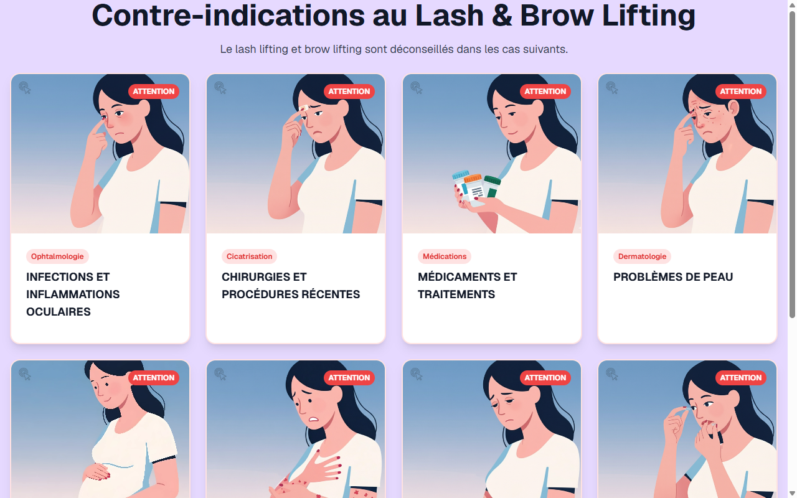

# Contre-indications Lash Lift — Combinaison LASH+BROW

**Course:** Combinaison LASH+BROW  
**Slide:** 3  
**Live URL:** https://lashlift.edtechiecorp.com  
**Stack:** Next.js · Tailwind CSS · TypeScript · GitHub Pages  

## What this slide does

Displays the contraindications for the lash lift component of the combined lash and brow course. Covers conditions that prevent performing a lash lift — including eye infections, certain medications, recent eye procedures, and contact lens use — in the context of a combined treatment session. Practitioners working with both lash lift and brow lamination need to assess contraindications for each procedure independently.

## Screenshot

## Usage

This slide is embedded as an iframe inside Coassemble at the live URL above. DNS is managed via Cloudflare (`edtechiecorp.com`). To update the slide, push to the `main` branch — GitHub Actions will rebuild and redeploy automatically.
